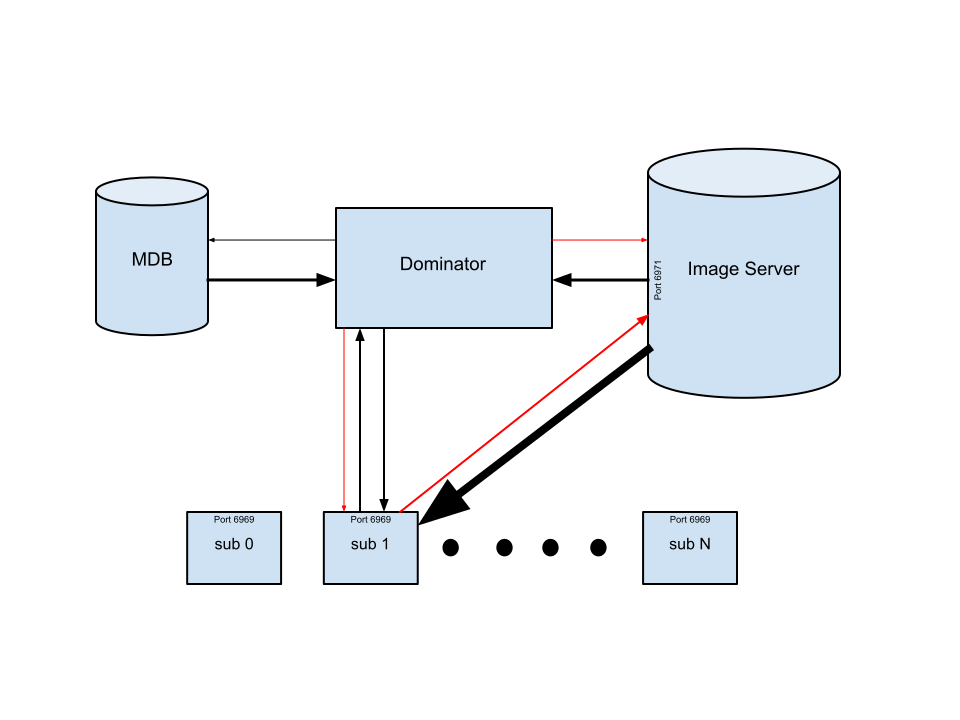
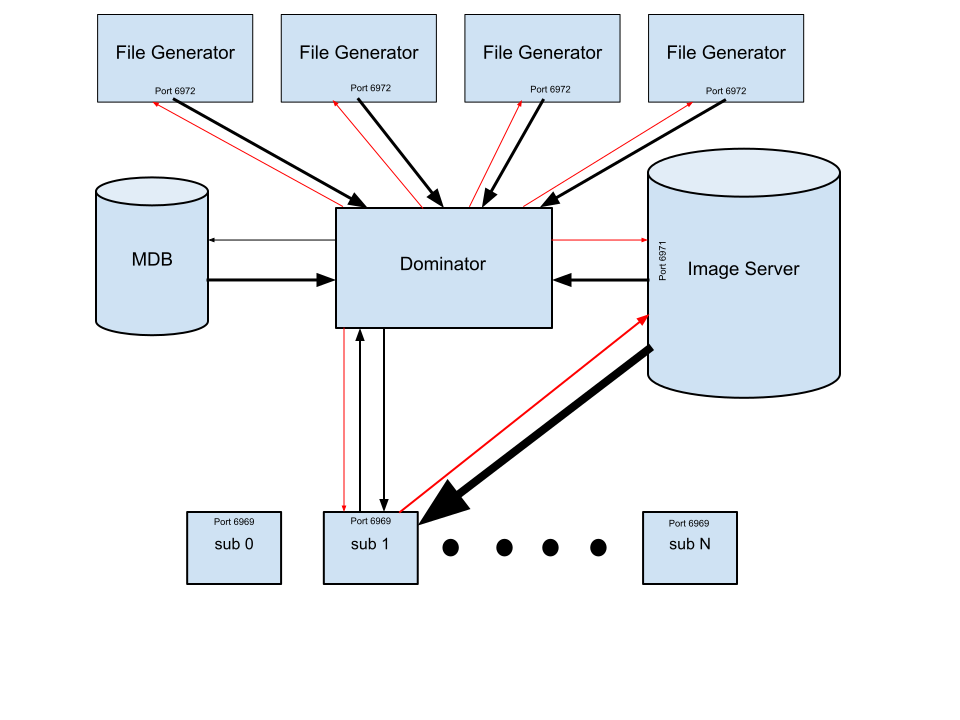
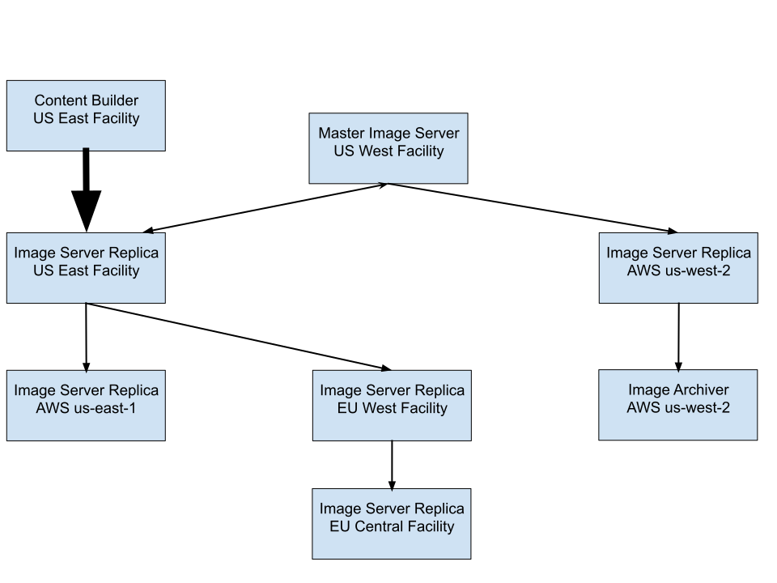

System Domination: Image Management
===================================
Richard Gooch
-------------    

Overview
========
Richard Gooch
-------------    

This document describes the design of a robust, reliable and efficient architecture which can scale to the very largest fleet of machines (physical or virtual). The design target is that a single system and administrator can manage the content of *at least* 10,000 systems with negligible performance impact on the managed systems, fast response to global changes and nearly atomic changes on those systems. The software system that implements this architecture is called the **Dominator**. This software is Open Source and available on [GitHub](https://github.com/Symantec/Dominator).

Background
==========

Managing a large fleet of computer systems presents a different set of challenges than managing a single system or a few systems. A variety of package management and configuration tools have been developed to more easily manage single systems, and they work well enough for that purpose, although they are human-intensive. When configuring and updating a fleet of systems, different tools are required. The case studies in the section below compare operational efficiencies between two organisations, one using conventional fleet management tools and another using a system like **Dominator**.

Several configuration management tools have been developed which leverage the package management paradigm to configure and maintain large numbers of machines. The **Dominator** takes a radically different approach to fleet management based on three principles:

-   immutable infrastructure

-   golden “baked” images

-   fast, robust transitions.

Rather than package management, the **Dominator** uses an image management and deployment approach.

The first two principles of immutable infrastructure and golden “baked” images have gained significant mindshare in recent years with the birth of the container development and deployment model. These two principles drive better development and operational behaviours and support comprehensive integration testing and reproducibility. This paradigm forces testing and configuration work to be 100% “front-loaded”, rather than the more familiar “push something first, then patch and configure later” model. The pre-config model yields both better quality testing and more confidence in deployments.

The third principle supports rapid and safe deployments. A fast transition reduces the chance of failure due to potential inconsistencies during the transition. A robust transition ensures that a transition does not fail part way through. Partial transitions can lead to failures if the system is left in an inconsistent state. Most configuration management systems fail to satisfy this principle, in large part due to their package-driven approach to updates.

One of the happy benefits of these three principles and the way **Dominator** implements them is that once an image has been baked and tested for “new” deployments, it is easy and safe to push that image to existing deployments, and to do so frequently and automatically. This leads to further benefits when images are scanned for vulnerabilities and compliance, as it is no longer necessary to scan machines: machines only need to be checked to ensure they have an approved image.

Operational Case Study Comparisons
----------------------------------

In one organisation with approximately 2,000 machines, a team of 30 engineers struggled with (and mostly failed) to keep systems in sync and up-to-date. This organisation did not have a tool like **Dominator** available. When an urgent security patch needed to be distributed, a team of 5 engineers performed some heroic work to deploy the fix to the fleet. Much of their time was spent selecting batches of machines to upgrade, push the upgrade and verify that the upgrade was completed and that the machines were not broken by the upgrade. Due to drift between the machines, there was no confidence that the fix was sure to work everywhere. In addition, updates were not certain to have completed. Each engineer was struggling to upgrade 400 machines.

In a well-known large Internet company, a system based on similar principles as **Dominator** is used to deploy significant changes to the entire fleet on a routine basis. The ratio of engineers (involved in pushing changes) to machines is 1:200,000. This dramatically better operational efficiency is due in part to a homogeneous operating environment, but also due to confidence in the testing and the reliability of the deployment system.

Non-goals
---------

The **Dominator** system is not intended to be used to maintain images used inside containers. Tools such as *Docker*, *Kubernetes* and *Spinnaker* provide effective life-cycle management of containers. **Dominator** is targeted to the infrastructure that hosts containers and workloads which are not well suited to running inside containers. Best practice is to have a single binary inside a container, not an OS image. Using **Dominator** for updating small container images is overkill.

The **Dominator** system is one component of machine life-cycle management. Other components of life-cycle management are out of scope in this document, and the **Dominator** is not prescriptive in the choice of those other components. In addition, the **Dominator** does not set policy on machine management (i.e. it does not prescribe image content or rollout policies). Instead, it is a policy *enforcement* tool. To give context, below is a high-level view of machine life-cycle stages:

1.  onboarding (discovery, bootstrapping)

2.  allocation (which pool of machines, intended use)

3.  policy choices (image selection, rollout speeds)

4.  image deployment, updating and drift management (**Dominator**)

5.  health monitoring and repair workflow

6.  reallocation (go to 2)

7.  off-boarding (deallocation, secure erasure, disposal)

Image life-cycle management is also a wider scope; **Dominator** may be a component of such a system (responsible for deployment), but does not prescribe the image life-cycle management system.

High-level Design
=================

A key differentiator between the **Dominator** approach to configuration management and other systems is that the configuration and application are baked into an image along with the OS, and the image is pushed to the subject machines. Essentially, the configuration is pre-computed into an image and the image is pushed to a set of “dumb” nodes which only need to move files around and restart services. Since the nodes are dumb, the system is more reliable and repeatable compared to systems where the nodes have to perform a series of complex changes with arbitrary dependencies.

The system is comprised of the following components:

-   an **Image Server** which stores images (file-system trees)

-   a **M**achine **D**ata**B**ase (**MDB**) which lists all the machines in the fleet and the name of the *required* image that should be on each machine (an enhancement is a secondary *planned* image for each machine)

-   a controller (master) system called the **Dominator**

-   a slave agent on each machine in the fleet called the **sub**ject daemon (**subd**)

The following diagram shows how these components are connected:


The Image Server
----------------

This is a thin front-end to an object storage system back-end. It provides authentication, encryption and metadata services with a simple RPC over HTTP interface, which is available on port 6971, along with a HTML status page, built-in dashboards and internal metrics. All the RPC interfaces in the **Dominator** system transmit data in GOB (Go Binary) format. This is a self-describing data format that supports backwards compatibility similarly to Google protobufs, providing a degree of decoupling between client and server.

Images are written to the **Image Server** (in compressed tar format), which decomposes the image into unique files which are stored as objects. If multiple images are stored where most of the files have the same contents, they are automatically de-duplicated. Thus, adding images which are mostly the same as existing images consumes little extra space.

Image names may be any valid POSIX pathname (the leading / is ignored). Images may be deleted, but a particular image name can never be re-used.

The MDB
-------

The **MDB** is the sole source of truth regarding which image (including configuration) is *required* to be on each machine. This makes it easy to gain a global view of the desired state of the fleet. This design also decouples *deployment and activation* from the *rollout policy and schedule*, which more easily allows for different policies for different groups or classes of systems and facilitates separation of powers. *Deployment and activation* is the scope of this document.

The **Dominator**
-----------------

The **Dominator** continuously polls all the **sub**s, the **Image Server** and the **MDB**, and computes the difference between the desired file-system state of each **sub** and its actual state, and instructs each deviant **sub** to make corrections (add files, update file contents or metadata, remove files, etc.) as well as where to fetch object (file) data from. In addition, all configuration data (such as data transfer limits) are sent by the **Dominator**. The **Dominator** thus has global knowledge of which images are *currently* on which machines, and may be queried to determine the true state of the fleet.

The **Dominator** has configurable global rate limits such as:

-   the percentage of machines (in a cluster) that may be in the rebooting state at any time

-   percent of network bandwidth available for file transfers to/from **sub**s

-   percent of local I/O bandwidth available for scanning files on the **sub**

-   percent of local I/O bandwidth available for writing fetched files on the **sub**

-   changes in health check failure rates and correlation with updates

The **Dominator** continuously drives **sub**s into compliance, and thus corrects and updates running machines as well as new (*birthed*) machines and machines which have returned from the dead, using the same mechanism. The **Dominator** presents a HTML status page on port 6970. This page contains links to various built-in dashboards. The same port is used to publish internal metrics.

The subs
--------

The **sub**s continuously poll their local file-systems and construct a representation of the file-system. This representation may be queried using a **poll** RPC request. The **sub**s present a HTML status page on port 6969, publish internal metrics and present a RPC over HTTP interface on the same port. They obey a small set of RPC commands: **respond to poll**, **fetch files**, **update**, **cleanup**, **get files**, **get configuration**, **set configuration** and **check health**. The **sub**s have no knowledge of packaging systems.

A **fetch from peer** RPC could support peer-to-peer file transfers. See the section below on performance targets which shows that this optimisation is not needed for mid-sized clusters (say 10,000 machines). Larger clusters (say 100,000 machines) may benefit from this optimisation.

Configuration Management
========================

Unlike other configuration management and deployment systems which group configuration file changes and package installation/upgrade/removal into bundles which are pushed out to sets of machines, the **Dominator** system separates configuration and package bundling from deployment. Instead, an image is created (separately from the **Dominator** system) which includes all the desired packages and configuration files for a class of machines, and that image is pushed to all machines of a certain class. This approach is based on the observation that large, efficiently managed fleets have only a few classes of machines. If you have many different classes of physical machines in your fleet, *you’re doing it wrong*, and *you probably should be using Containers*.

The **Dominator** system supports an arbitrary number of machine classes (since each machine may have a different image), but pushes the pain and complexity to where it belongs: a dedicated configuration system and the people who make the choices for how many different machine classes they want.

The **Dominator** should be able to push updates at the same speed regardless of how many different machine classes (images) need to be pushed, since each machine has just one *required* image. Thus, one could build images for OpenStack compute nodes, Kubelet minions, Ceph storage nodes and Analytics nodes and decide the role for each machine by assigning the appropriate image for each machine in the **MDB**.

A consequence of the image-based deployment system is that integration testing is much simpler to manage than other systems where a “base” image is deployed and then different machines are configured to receive different collections of extra packages. Those systems can lead to an impractically large configuration matrix, which requires many different combinations to be tested and where it is difficult to grasp the disposition of the fleet.

With the image-based system, testing is clear: the image is tested. Once that is done, the image can be deployed to a large number of machines with confidence, knowing that there will not be a difficult to understand collection of packages added on top, which may have cross dependency problems or incompatibility issues with the base image.

The Life of an Update
=====================

Consider updating the image on a single machine. The following steps are taken:

-   the new *required* image is written to the **MDB** record for the machine

-   the **Dominator** computes the *required* file-system state based on the image name recorded in the **MDB** and the results of the last poll of the **sub**

-   the **Dominator** directs the **sub** to fetch any files it needs from the **Image Server** and store them in a private cache, provided the **sub** has sufficient space available

-   the **Dominator** re-polls the **sub** and if all the required files are available directs it to perform the update

-   the **sub** will perform a nearly atomic update on the system, ensuring that the time that the system spends in an inconsistent state is minimal (typically a small fraction of a second):

    -   move the fetched files to their desired locations

    -   delete unwanted files

    -   restart any affected daemons, perform a health check and return the completion status and result to the **Dominator** in the next **poll** response (if the kernel was not changed)

    -   reboot the machine (if the kernel was changed)

-   the **Dominator** will continue to poll the **sub** for its file-system state and health check results

From the perspective of the **Dominator** system, performing an update is the same as keeping machines in compliance. The only difference is that the number of files to fetch and change is usually larger with an update.

Note that a key property of this design is the nearly atomic update of the **sub**. This is fundamentally different from many other configuration change systems, which typically push higher-level commands to update packages and configuration files, requiring the target machines to perform more work and resolve package dependencies during the update. That approach leaves the machine in an inconsistent state for longer even in the best case where all the changes can be performed and the dependencies met in a single update run. In practice, subtle dependency problems, network interruptions or problems with the package repository can cause an update to fail, leaving the system partially updated until the next update run comes along.

Kernels, Images and Firmware
============================

The **Dominator** system can handle not just system images but also kernels and firmware. The data component of kernels and firmware are the same as for system images: files in the file-system. The only difference is their *activation*:

-   system images are activated by moving the files in place and restarting any daemons that depend on the changed files

-   kernels are activated by rebooting the machine

-   firmwares (BIOS, network controller, etc.) are activated by writing to special device files and restarting the device and device driver or rebooting the machine

These differences are just configuration details to the **Dominator** system.

Component Details
=================

Image Server
------------

The **Image Server** processes *add image* and *add objects* RPCs and saves the image and object data to the local file-system. An image is a representation of a file-system tree, with the file data encoded into the image structure as SHA-512 checksum. The file checksums are used as object IDs. Thus, multiple copies of the same or similar image only requires storing the image representations each time. The unique file data are stored only once, as objects.

Image names may be any valid POSIX-like pathname (leading ‘/’ is ignored). Directories may be created and owner groups assigned to delegate image management of subtrees in the namespace to different teams.

The **Image Server** responds to *get image*, *list images* and *get objects* RPCs by the **Dominator** and **subd**.

An **Image Server** can be “slaved” to another **Image Server**. This is used for image replication between servers. Any (non-cyclic) topology can be constructed. Image replication is secured with TLS and access controls. An example Content Distribution Network is shown in Appendix 2.

An operations guide for the **Image Server** is available [here](https://github.com/Symantec/Dominator/blob/master/cmd/imageserver/README.md).

Subd
----

The **subd** component bears some similarity to rsync, scp, BitTorrent and other file distribution technologies, but it also performs carefully orchestrated *activation* functions, and thus a special-purpose daemon is best suited. Key properties of **subd** are:

-   rate-limited scanning of the local file-system

-   rate-limited network transfers

-   authenticated RPCs

-   directed file transfers (i.e. it’s told where to fetch files from)

-   authenticated file transfers

-   separate *fetching* and *activation* phases

-   nearly atomic *activation* (to avoid inconsistencies during transitions)

-   health checking (to limit the damage done by the push of a bad change)

-   the ability to detect file corruption through constant checksum scanning of the file-system (SHA-512 is employed). Some examples of file corruption that evades detection by mechanisms such as inotify/fanotify but is detected with checksum scanning:

    -   hardware errors

    -   firmware bugs

    -   kernel bugs

    -   malicious/exploit code (either directly writing to the block device, memory, or leveraging kernel bugs)

In summary, **subd** provides safe, secure slow or fast *fetching* and fast *activation*. Some of the properties mentioned are covered in more detail below. An operations guide for **subd** is available [here](https://github.com/Symantec/Dominator/blob/master/cmd/subd/README.md).

### Rate-limited scanning

The file-system scanning is rate limited to reduce the I/O impact of **subd**. The performance of the storage device is benchmarked the first time **subd** is started, and further reads from the storage device are limited by default to 2% of the benchmarked speed. By limiting to 2%, **subd** has negligible impact on system workload. Note that if the entire file-system being scanned fits inside the page cache of the machine, then little or no transfers from the storage device are required, and thus **subd** will scan the file-system at maximum speed. If there is insufficient memory to cache the entire file-system, then **subd** will detect that it is reading from the storage device and will automatically reduce speed. Furthermore, in environments where there is competition for memory, the rate limiting performed by **subd** will in turn reduce the memory pressure it places on the system. This process is completely automatic. In summary, **subd** will consume more system resources on an idle machine and will consume a small trickle of resources on a busy machine.

### Scanning versus file notification

File scanning and checksumming is more robust than file change notification (i.e. *dnotify*, *inotify* and *fanotify*), as it can detect file changes due to storage media corruption, file-system corruption, memory errors, kernel bugs, direct writes to the underlying block device, intrusions and so on. File notification systems are not able to detect these types of changes. For these reasons, file scanning and checksumming is *essential* whereas file notification can at best serve as an *optional optimisation* which may be used to reduce the time to detection of file changes.

### Rate-limited network transfers

Similarly to the file-system scan rate-limiting, **subd** will benchmark the network capacity and will limit network file fetches by default to 10% of the capacity. This limit is not dynamically adjusted, although it is configurable.

Security: Authentication and Authorisation
==========================================

Connections between the components may be secured using SSL/TLS1.2 or later. The components will switch to and require secure mode if provided with SSL certificates and keys. In secure mode, clients must authenticate to the servers in order to secure RPC endpoints. Servers must present a valid and trusted certificate to the clients.

A client is permitted to call a RPC endpoint if it has the `Service.Method` name present in a comma separated list in the Common Name section of the certificate subject. The certificate must be signed by the Certificate Authority (or a trusted intermediate) that the server trusts. This approach allows creating certificates for service accounts with the required powers (i.e. the **Dominator** would have `Subd.*` power) and certificates for different users who may have different powers (i.e. some users may only have `ImageServer.AddImage,ObjectServer.AddObjects` powers).

Configuration
=============

MDB Data
--------

The **Dominator** requires a list of machines and their *required* and *planned* images. It obtains this information from a **MDB**. The **Dominator** does not directly contact the **MDB**, instead it reads a file with a simple JSON format that contains the information it requires. The **Dominator** periodically checks the metadata (size, mtime, inum, etc.) for this file and if it’s changed it reads the new file. A separate daemon or cron job reads from the **MDB** and writes out a new file. The writer of this file should write the data to a temporary file on the same file-system and then atomically move the file to the desired location (`/var/lib/Dominator/mdb` by default). This ensures the **Dominator** does not read partial files.

Below is an example JSON file containing three machines:
```
[
    {
        "Hostname": "mailhost",
        "RequiredImage": "mail.0",
        "PlannedImage": "mail.1"
    },
    {
        "Hostname": "compute0",
        "RequiredImage": "ubuntu-14.04",
        "PlannedImage": "ubuntu-14.05"
    },
    {
        "Hostname": "compute1",
        "RequiredImage": "centos-6",
        "PlannedImage": "centos-7"
    }
]
```
It is safe to not specify `PlannedImage`. It is also safe to include extra fields (they will be ignored).

Images
------

Images are uploaded to the **Image Server** using the imagetool utility. This utility performs many image-related commands, including add image. The syntax is:
```
imagetool add name imagefile filterfile triggerfile
```
The `name` parameter is the desired name of the image.

The `imagefile` parameter is the path to a (possibly compressed) tar file containing the file-system image.

The `filterfile` parameter refers to a file which contains lines. Each line contains a regular expression which specifies which files should be excluded from the image and which will *not be updated on the **sub***. Below is an example filter file:
```
/tmp/.*
/var/log/.*
/var/mail/.*
/var/spool/.*
/var/tmp/.*
```
The `triggerfile` parameter refers to a JSON-encoded file containing a list of *triggers*. A *trigger* is a rule that will (re)start a specified service if any of a set of files (defined by regular expression pattern matches) are changed during due to an *update*. Below is an example trigger file:
```
[
    {
        "MatchLines": [
            "/etc/ssh/.*",
            "/usr/sbin/sshd"
        ],
        "Service": "ssh",
        "HighImpact": false
    },
    {
        "MatchLines": [
            "/etc/cron[.]*",
            "/usr/sbin/cron"
        ],
        "Service": "cron",
        "HighImpact": false
    },
    {
        "MatchLines": [
            "/lib/modules/.*",
            "/boot/vmlinuz-.*"
        ],
        "Service": "reboot",
        "HighImpact": true
    }
]
```
Services are (re)started by passing the name of the service and either `start` or `stop` to the service utility.

The `HighImpact` field is used to tell the **Dominator** that (re)starting the service will have a high impact on the machine (such as a reboot). The **Dominator** can use this limit the number of high impact changes at a time (e.g. to enforce a policy that no more than 100 machines at a time will be rebooted, it will wait for machines to come back up before rebooting more).

Advanced Features
=================

Computed Files
--------------

Each system has three classes of files:

-   those which should be the same on every machine and thus should be managed by the **Dominator**

-   those which are unique per machine and do not need to be managed/updated centrally (system logs in `/var/log` and hardware-specific data such as in `/etc/fstab`) and are thus excluded from **Domination**

-   those which are common to groups of machines but may not be common across the entire fleet, yet follow a pattern and thus may be computed. These are *computed files* and are discussed here.

Consider the `/etc/resolv.conf` file, which contains the IP address of the DNS server. In typical global fleets there are multiple datacentres, each with its own DNS server (a single global DNS server would have poor performance characteristics). In environments where it is not feasible to set up a Virtual IP address for the DNS server (where the network directs DNS query traffic to the nearest DNS server), every machine in a datacentre shares the same file, but this file differs in other datacentres, so it cannot be baked into a common image. This is a good use-case for computed files, where the **Dominator** is configured to compute the contents of this file based on the datacentre.

Another example is the `/etc/ssl/CA.pem` file, which **subd** uses to determine which **Dominator** to trust for change RPCs. It may be necessary to establish different “zones of trust” within an organisation. Consider a Hybrid Cloud environment where an organisation has private (internal) cloud infrastructure as well as using Public Cloud providers. Some shared trust is likely to be desirable, such as allowing an **Image Server** in the Public Cloud to be configured as a replication slave of an **Image Server** in the internal cloud. This arrangement is useful for distributing images across the full Hybrid Cloud environment. However, it may not be desirable to use the same trust zone for updates, since an organisation may not want a **Dominator** in a Public Cloud to be able to control the contents of machines in their internal cloud. This is where computed files are useful. The `/etc/ssl/CA.pem` file can be configured to be a computed file, and thus different contents can be pushed to **subs** in different trust zones, and the **Dominators** will have different keys which are trusted in different trust zones. The trust zones for updates can be completely separated or (more usefully) a certificate signed by the “internal cloud” CA is trusted everywhere whereas a certificate signed by the CA for a particular Public Cloud provider is only trusted in that trust zone.

A special case of computed files are files which are unique per machine yet can (or should) be centrally managed and distributed. An example of this is machine certificates. One approach is to exclude these files from **Domination** and have the machine **Birther** generate and place these files. This approach makes it difficult to revoke/replace certificates. Alternatively, these certificates could be computed by the **Dominator** (perhaps with it calling a certificate generation service) and then distributed by the **Dominator**. If necessary a fleet-wide certificate update could be performed in seconds, with the limiting factor likely being the speed at which certificates can be generated.

Computed files are generated by instances of the **filegen-server**. When an image is constructed, some files in the image may be marked as computed files with the source of the file data being the address (hostname:port) of a **filegen-server**. A single image may contain multiple computed files sourced from different **filegen-server**s. When the **Dominator** pushes an image to a **sub** it will query the appropriate **filegen-server** to obtain file data for any computed files and push that data to the **sub**.

In the above example of using the **Dominator** to distribute machine certificates, a **filegen-server** could be deployed which generates these certificates on demand. The **filegen-server** API supports the concept of a time limit on the validity of file data and will automatically regenerate file data that have “expired”, which will in turn lead to the **Dominator** pushing updates to the **sub**s. An example configuration would be to generate certificates with 24 hour lifetimes and mark the file data as valid for 12 hours. The certificate for each **sub** would be re-generated and distributed every 12 hours. Provided the **Dominator** system was not down for over 12 hours, every **sub** would always have a valid certificate.

The diagram below shows multiple **filegen-server**s and their communication paths.


Planned Images
--------------

This mechanism supports a controllable “preload” of image data, which is useful for automated image build systems. Consider the following sequence:

-   the image build system produces a new image

-   the image build system updates some or all of the *planned* image entries in the **MDB**. It has access rights to do this, since this is a safe operation. It may not have access rights to update the *required* image entry for all machines, as that is a potentially unsafe operation, or may violate rollout policies

-   a regression test is started on a pool of test machines. The image build system has update access rights to the *required* image field for these machines

-   once the regression test passes, the image build system updates the *required* image field for a larger set of canary machines (which it has access rights to), such as a single datacentre

-   the new image will probably be preloaded on all the canary machines by the time the regression test completes, thus it can be deployed as quickly as policy allows

-   once the defined canary time has passed, the new image can be pushed globally, again as fast as policy allows. A different system (or person) may have the access rights to updated the *required* image field for all machines

The *planned* image is only pushed if the *active* image is the same as the *required* image.

Fast, Secure re-Imaging
-----------------------

This section posits a [**Birther**](../MachineBirthing/README.md) system which is designed to leverage the **Dominator** to deploy images. This system is not implemented, so this section is currently a guide to how it would work.

When a machine is re-provisioned for a different purpose, it may be wise to *re-image* it (wipe the file-system and re-install). This is typically done by sending a machine back to the **Birther** which already takes care of creating file-systems and installing the OS image. This is an expensive operation as it requires fetching the full OS image across the network.

A **Birther** boot image can take advantage of the **Dominator** by copying the file-system contents to a tmpfs prior to repartitioning/reformatting file-systems and then can move the saved files to the newly created file-system inside the object cache directory maintained by **subd**. In general the new OS image will have many files (objects) in common with the old OS image, and thus the **Dominator** will generate only a small amount of network traffic to perform a full re-image of the machine.

This system is secure (i.e. the old incarnation cannot leave a trojan behind for the next incarnation) because old files will be fully checksummed as they are moved into the object cache, assuring that only intended files are moved to the new file-system. In addition, the object cache is purged of unused objects. Since the process of converting the file-system into an object cache is performed while booted into the trusted **Birther** boot image, there is no running code from the old file-system which could subvert this security.

The **fs2objectcache** utility has been implemented which performs the conversion of a file-system to an object cache. The **Dominator** is ready to support this feature.

The new OS image can even be “pre-loaded” prior to re-provisioning by setting the *planned* image appropriately. This would facilitate even faster re-imaging, which is useful in environments where limiting downtime is critical.

Domination as a Service (DaaS)
==============================

The **Dominator** system is intended to be one component of a robust and scalable foundation for Cloud infrastructure (the “Undercloud”): the management of a fleet of physical machines. This system can also be used within a fleet of virtual machines, where a customer/tenant sets up one VM to run the **Dominator**, **Image Server** and **MDB**. An alternative is to use the same system used for the Undercloud for tenant VMs. This is termed **Domination as a Service** (**DaaS**), and has the following extra requirements:

-   VMs are recorded in the **MDB**

-   tenant networks are configured to allow traffic to/from the **Dominator** and **Image Server**

Calculating Performance Targets
===============================

File Fetching
-------------

As stated earlier, a single **Dominator** system and a single **Image Server** system should be able to manage at least 10,000 **sub**s. Let’s consider the following environment:

-   a cluster of 10,000 machines

-   1 GB/s (10 Gb/s) network

-   1 GB system image

-   SSD storage with 500 MB/s write throughput

In this environment, it would be possible to perform a complete system upgrade (such as when [**birthing**](../MachineBirthing/README.md) a machine) for a single machine in 2 seconds. When birthing many machines, the limiting factor is downloading the system image, as this is the largest component of network traffic. Thus, 3,600 machine per hour can be birthed *without any peer-to-peer enhancements*, with the limiting factor being bandwidth out of the **Image Server**.

A typical “large” system image upgrade changes less than 10% of the files on the system, which would require less than 100 MB of network traffic to each **sub**, which can be transferred in 0.1 seconds at maximum network speed. For such a change, 10 machines per second could be upgraded, which would be 1,000 seconds (under 17 minutes) for an upgrade of all 10,000 machines in the cluster. Again, this is *without any peer-to-peer enhancements*.

During normal operations, it is probably undesirable to consume the entire network bandwidth of a **sub** for system upgrades, even for 100 milliseconds, as this could affect customer jobs running on the machine. Policy will probably dictate that no more than 10% of the network bandwidth can be used for non-emergency pushes. This would increase the time taken by each **sub** to *fetch* its files to 1 second and thus increase the time to upgrade each **sub**, but since multiple **sub**s can fetch from the same **Image Server**, the time to upgrade the 10,000 machine cluster remains the same: under 17 minutes. This probably exceeds the maximum speed at which operations staff are comfortable with upgrading an entire cluster (especially if the cluster contains more than a few percent of the global capacity).

Once again, the limiting factor is bandwidth out of the **Image Server**, and the speed at which the system can perform probably greatly exceeds the speed at which operations staff would accept under normal circumstances.

A typical “small” system image update is around 1 MB (configuration files and a security fix for a package). The **Image Server** can distribute updates to 1,000 machines per second, so a 10,000 machine cluster could be upgraded in 10 seconds. Once again, this is *without any peer-to-peer enhancements*. This is probably too fast except for emergency pushes.

The above examples show that it is more important to implement configurable rate limits for the **Dominator** system rather than optimise pushing data around.

File Scanning
-------------

The file-system is continuously scanned by **subd**. The time it takes to complete a full scan determines how “fresh” its state information is, which in turn is a limiting factor in how quickly the **Dominator** system can correct files on deviant machines. A typical HDD can sustain a read speed of 50 MB/s, assuming mostly contiguous reads. At this speed a 1 GB file-system can be scanned in 20 seconds.

Continuously scanning the file-system at the maximum rate would interfere with I/O for jobs running on the system (unless the system image is stored on a dedicated device containing the root file-system), so the scanning rate is likely to be configured to be 2% of the maximum sustainable rate (1 MB/s for a typical HDD). Thus, a full file-system scan would take 1,000 seconds (under 17 minutes). A 17 minute delay from deviation to detection is probably sufficient for most environments.

The performance of SSDs are typically at least 10 times faster than HDDs (500 MB/s or more), so a 1 GB file-system scan at 2% of the maximum rate would take 100 seconds. If a 17 minute deviation to detection delay is too large, the root file-system should be placed on SSD.

Polling
-------

The **Dominator** continuously polls each **sub** in the fleet to determine its current file-system state. A 1 GB system image typically contains 40,000 files with an average filename length of 50 bytes and a checksum length of 64 bytes (SHA-512). The file-system state would thus consume 4.56 MB. Here the limiting factor is bandwidth into the **Dominator**, which can poll 219 **sub**s per second. In a 10,000 **sub** cluster, the **Dominator** would poll each **sub** every 46 seconds, which is much lower than the file-system scanning time. A single **Dominator** could scale to 219,000 machines with HDDs before polling became a limiting factor.

Polling speed is optimised since each **sub** stores a generation count of the file-system state which increments when a scan yields different file-system state compared to the previous scan. This generation count is reported in the **poll** response. The **Dominator** records the generation counter and includes it in the **poll** request. The **sub** will only provide the file-system state information if the generation counts differ. In most cases, the OS file-system state does not change between polls, so this would be a very effective optimisation. The limiting factor would probably be the time taken to set up TCP connections and perform the TLS handshake. A single **Dominator** machine could likely handle polling of 1,000,000 or more **sub** machines.

Birthing Machines
=================

The **Dominator** system may be used to optimise the birthing of machines. The [**Birther**](../MachineBirthing/README.md) system would install a minimal payload on a machine (**subd** and an appropriate certificate authority file), start up **subd**, add the machine to the **MDB** and wait for the **Dominator** to install the system image, which will complete the birthing process. [**Birthing**](../MachineBirthing/README.md) machines is the subject of a separate document.

Auditing, Compliance Enforcement and Intrusion Detection
========================================================

The **Dominator** system is clearly a compliance enforcement system, as it continuously forces systems into the *required* state. As seen above, with SSD storage, a **sub** with minor deviations can be forced back into compliance in under 2 minutes, with negligible performance impact on system workload.

Since the **Dominator** has knowledge of intended changes and the state of all **sub**s in the fleet, it can also be queried for auditing purposes and intrusion detection. For example, unexpected changes to the `/etc/passwd` file may indicate unapproved changes (users making changes outside the proper channels) or a possible intrusion attempt. By logging all changes made by the system (and the reason for the changes), global auditing and intrusion detection tools can easily be developed.

Operational Guidelines
======================

Below are some guidelines for reliable operations:

-   size the root file-system to be twice the image size, as this will avoid updates being blocked due to lack of space

-   keep logs and spool data on a separate file-system, so that out-of-control data cannot block updates (a working update system can be critical during emergency repairs)

Below are some best practices guidelines:

-   set the default network bandwidth for **sub**s to 10% of their capacity

-   set the default local I/O bandwidth on **sub**s for scanning the root file-system to:

    -   2% of capacity if stored on a shared device

    -   50% of capacity if stored on a dedicated device

-   restrict write access to the **MDB** to trusted services which can enforce policies such as:

    -   minimum time to upgrade a cluster (by limiting the rate at which the *required* image name fields can be changed) to give operations staff time to notice a disaster and hit the emergency brake

    -   do not update an image name field if the image has been tagged as deprecated

Implementation
==============

The **Dominator** is written in the [Go](https://www.golang.org/) programming language. It is an Open Source project hosted on the [Symantec/Dominator](https://github.com/Symantec/Dominator) page at [GitHub](https://www.github.com/). Contributions are welcome. A short [fact sheet](FactSheet.md) and [architectural overview](ArchitecturalOverview.md) are available.

Release Milestones
==================

Below are the anticipated releases:

Version 0: Minimum Viable Product (Released 8-Nov-2015)
-------------------------------------------------------

This is the minimum needed to be able to push images, update machines and keep them in compliance. The following features are not expected to be available:

-   **authentication and authorisation of RPCs**

-   integration with a real MDB

-   scaling and performance optimisations

-   nice dashboards

-   deleting of images

-   storing object data in an object storage system such as Ceph

-   Glance integration

The most serious limitation is the lack of RPC security (authentication). It was omitted from **v0** in order to speed development and provide a MVP to people who wish to experiment and evaluate the technology.

Without RPC authentications, anyone with network access to your **sub**s can set up their own **Dominator** instance and use it to control your **sub**s.

Version 1: Security (Released 10-Dec-2015)
------------------------------------------

This will add authentication and authorisation for the sensitive RPCs (in particular, the Update() RPC). The **sub**s will have a Certificate Authority file which they can use to validate that Update() RPCs come from the authorised **Dominator**. This addition will make the system safe to deploy and use.

Version 2: Integration with a real MDB (Released 30-Jan-2016)
-------------------------------------------------------------

This will add integration with a MDB implementation (most likely the implementation adopted at Symantec, where most of the development is being done). This represents an important milestone for Symantec internal use, but other users may prefer to write a simple script to interface to their particular MDB implementation. The **Dominator** reads a simple JSON file from the local file-system, so generating **Dominator**-compatible MDB data is trivial.

Version 3: Computed Files (Released 19-Mar-2016)
------------------------------------------------

This will add support for *computed files* as described above.

Version 4: Scaling and Performance Optimisations
------------------------------------------------

The MVP may not be as lean and efficient as desired, which could be an issue for herds with many thousands of machines.

Version 5: Nice Dashboards
--------------------------

The MVP will come with some basic dashboards. After some operational experience, it is anticipated that an improved set of dashboards will be designed and implemented.

Version 6: Storage Improvements
-------------------------------

Over time an installation will begin to fill up the local storage capacity of the system hosting the **Image Server**. Safely deleting unused images and performing garbage collection will be simple improvements that should help a lot. If needed, further improvements such as using Ceph for object storage may be implemented.

For an environment where deep OpenStack integration is needed, it may be useful to integrate with Glance. For example, if there is an image release pipeline where images are moved from one system to the next as they pass the various qualification, testing and deployment stages, images may flow directly between Glance and the **Dominator** system (although which direction the images may flow would depend on the whole release pipeline design).

Appendix 1: subd Performance Data
=================================

The following table presents data on performance impact measurements for subd. The sysbench benchmarking tool was used to measure CPU, I/O and memory performance without subd running, and then again with subd running. All the results show time taken to perform a benchmark (in seconds). In all cases, the file-system is backed by EBS. Lower numbers are better.

| **Machine Type** | **CPU without subd** | **CPU with subd** | **File I/O without subd** | **File I/O with subd** | **Memory without subd** | **Memory with subd** |
|------------------|----------------------|-------------------|---------------------------|------------------------|-------------------------|----------------------|
| AWS t2.micro     | 11.4586              | 11.6055           | 32.6241                   | 32.6238                | 70.8254                 | 70.3938              |
| AWS t2.medium    | 11.5638              | 11.5633           | 42.998                    | 32.8201                | 73.9858                 | 74.1603              |
| AWS m3.medium    | 22.8409              | 24.9580           | 55.2227                   | 55.3405                | 135.5237                | 149.6894             |
| AWS c4.xlarge    | 9.7052               | 9.7700            | 22.3376                   | 22.3665                | 61.6101                 | 62.1307              |
| AWS d2.xlarge    | 11.8251              | 11.5455           | 23.4539                   | 23.3757                | 75.0767                 | 75.0598              |

As can be seen from these results, in general the performance impact of subd on the simulated workload (sysbench) was negligible.

The exception was on the m3.medium machine type, where there was a ~9% impact on CPU-intensive and memory operations (memory and CPU have similar contention behaviour). The reason only this instance showed a measurable impact is because the machine has a single CPU, so there is some contention for the CPU. Since subd runs at a lower priority (nice +15) than the simulated workload, it receives ~8% of the CPU resources.

This contention did not occur on the t2.micro machine which also has a single CPU because the t2.micro machine has insufficient RAM to hold the root file-system in the page cache, and thus scanning the file-system requires accessing the underlying media, which triggers the I/O rate-limiting in subd and thus it spends most of it’s time sleeping, so as to not exceed 2% of the I/O capacity.

There was one anomalous measurement where file I/O on the t2.medium machine was faster with subd running than without. This can be explained by natural variation in the performance of EBS.

Auto-Scaling
------------

When subd is CPU-bound (this can occur when the root file-system can fit into unused RAM and there is little memory pressure on the system), it has the potential to affect the auto scaling behaviour for AWS instances. Specifically, if the auto scaling group is configured to launch new instances (“scale out”) when the CPU utilisation exceeds a defined threshold *and* the CPU-bound subd causes the CPU utilisation to exceed this threshold, then new instances will continue to be launched until the maximum instance limit is reached. This can lead to unnecessary resources being consumed. A series of tests were performed with a variety of instance types and an auto scaling group was created where new instances would be launched if CPU utilisation exceeded 80%. The following results were observed (and are expected given an understanding of the instance types):

-   t2.micro (burstable) instances. In this case, the root file-system (~1.5 GB) did not fit into RAM (1 GiB), so subd used &lt; 1% CPU on average. No extra instances were launched by the auto scaler

-   t2.small (burstable) instances. In this case, the CPU consumption of subd caused other instances to be launched and later were terminated. This is because each instance bursted to 100% CPU utilisation for ~20 minutes, which caused another instance to be launched. After ~20 minutes, the instances consumed their initial CPU credits and were throttled, which in turn lowered their CPU utilisation and the auto scaler terminated (“scaled in”) instances

-   m3.medium instances. In this case, the auto scaler continued to launch new instances until the maximum instance limit was reached. This instance type has a single VCPU and thus the CPU utilisation was 100%, which triggers the auto scaler

-   m3.large and larger instances. In this case, the auto scaler did not create new instances. This is because these instances have multiple VCPUs and subd consumed 100% of a single VCPU. Thus, for the m3.large instance, the CPU utilisation was 50%, which was under the scale-out threshold

The first lesson from these experiments is that burstable instances should not be used with auto scaling, as the throttling behaviour conflicts with the auto scaling. The second lesson is that auto scaling should be used with care the behaviour should be measured with small limits before opening the floodgates. The third lesson is that CPU utilisation is an inadequate metric for deciding whether to scale out, as it does not reflect the performance of the workload. A better measure would be application latency or throughput.

In summary, for most instance types, subd should be safe with auto scaling, as it will use 100%/nVCPU. With the exception of the m3.medium instance type where nVCPU=1, this utilisation will be below 50%. Even on an m3.medium instance, the application will likely consume sufficient RAM such that the root file-system cannot fit into the remaining RAM, and thus subd will rate limit its I/O and use a tiny amount of CPU.

Appendix 2: Image Content Distribution Network
==============================================

The diagram below is an example of a real-life network of **Image Servers** which distribute content globally. In this example, the content builder is in an on-premise facility in US East. It uploads new images to the nearby **Image Server** which will send any new objects to it’s master (upstream **Image Server**), which in turn sends to its master (in this example the root master). The (root) master **Image Server** is responsible for checking the uniqueness of objects (i.e. hash collision detection) and images.

The thick arrow indicates that the entire uploaded image is transmitted to the nearby **Image Server** (required for detecting hash collisions). The other arrows are thin, representing that only new objects are transmitted (it’s typical that an image upload has fewer than 1% new objects).

This architecture ensures that - even if a content builder has a slow link to the rest of the network - injecting images can still be very fast if there is a nearby **Image Server** replica with a high speed connection to the content builder.

