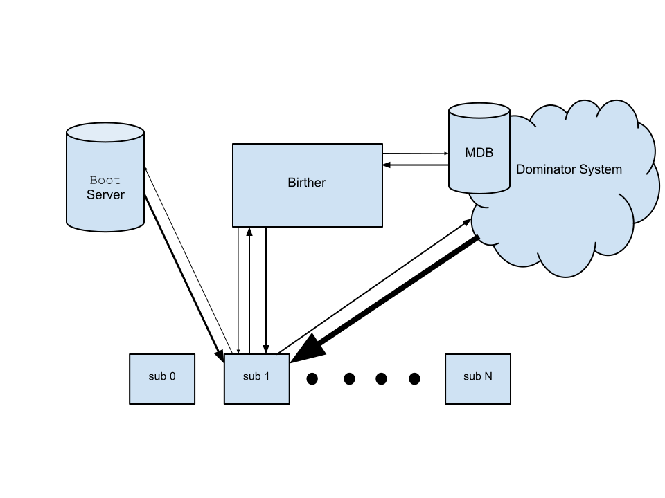

Machine Birthing
================
Richard Gooch
-------------

Background
==========

Growing machine capacity in a datacentre environment is often done by rolling in multiple racks of machines, wiring them in and powering them up. Once powered up, it is common for operations staff to use scripts and other automation tools to *birth* (install and configure) the machines. These automation tools typically build on top of other tools which were designed to birth a single machine (i.e. boot from an installation CD/ISO image). The layers of tools can make the birthing process less reliable and efficient, and leave the machine in a state where it is ready for further configuration rather than being ready for actual useful work. These tools often neglect other aspects of the machine life-cycle, such as automated repairs.

This document describes the design of a fully automated, robust, reliable and efficient architecture for (re)birthing machines at large scale. The design target is that 100 racks of machines can be turned on and within an hour all the new machines are available for real work, *without any further human intervention* nor any preparatory software configuration. The software system that will implement this architecture is called the **Birther**.

The **Birther** system depends on the [**Dominator**](../Dominator/README.md) system, which is likely to be the limiting factor in how quickly machines can be made available for real work. A more focussed design target for the **Birther** system is that it can **sub**ject more machines per second to **Domination** than the **Dominator** can complete a full system update on per second.

High-level Design
=================

The system is comprised of the following components:

-   a **M**achine **D**ata**B**ase (**MDB**) which lists all the machines in the fleet and their properties

-   a **Birther** machine which responds to PXE boot requests from machines

-   a **Boot** **Server** (containing a DHCP and TFTP server), which is used to install a tiny **Bootstrap Image**

-   a **Bootstrap Image** which configures the machine, enters it into the **MDB** and enables the machine for **Domination**

-   a [**Dominator**](../Dominator/README.md) system which is used to install fully configured, workload-ready images

The following diagram shows how these components are connected:

The MDB
-------

The **MDB** is the sole source of truth which defines the intended state of the fleet. It lists all the known machines in the fleet and records the name, IP address, MAC address, *required* system image, repair state and so on.

The Birther
-----------

The **Birther** listens for PXE boot requests from any machine, and consults the **MDB** to determine what kind of response to send. In all cases, a response is sent. The following **MDB** states are defined:

-   *unknown*: the system is not yet known in the **MDB**

-   *birth*: a temporary private IP address is assigned and the PXE response instructs the machine to load and boot the **Bootstrap Image**

-   *healthy*: the system is known in the **MDB** and is considered healthy. The PXE response instructs the machine to boot from local media. This is an optimisation that dramatically decreases system reboot time, as the machine does not have to wait for the PXE boot timeout before booting from local media

-   *rebirth*: the system is known in the **MDB** and is in need of a software repair (a **rebirth**). The permanent IP address is assigned and the PXE response instructs the machine to load and boot the **Bootstrap Image**

-   *clean*: the system is known in the **MDB** and needs to be cleaned (old data removed). The permanent IP address is assigned and the PXE response instructs the machine to load and boot the **Fast Bootstrap Image**

The **Birther** stores PXE boot request and response statistics in the **MDB** so that persistently failing machines can be detected.

The Boot Server
---------------

The **Boot Server** contains a DHCP and TFTP server and serves requests for the **Bootstrap Image**. It will respond to requests on the private IP network used for temporary addresses as well as requests on the main IP network for permanent addresses. The Hypervisor in SmallStack (part of the [**Dominator**](../Dominator/README.md) ecosystem) contains a **Boot Server** which is integrated with the ecosystem (including image building and distribution). Consult your favourite search engine for generic implementations.

The Bootstrap Image
-------------------

The **Bootstrap Image** contains:

-   a generic kernel

-   a small compressed file-system which contains:

    -   a configuration tool, which is run as the *init* process

    -   a copy of **subd** from the **Dominator** system and a Certificate Authority file

The configuration tool performs initial setup and then hands the machine over to the **Dominator**.

### 

### The Fast Bootstrap Image

This is the same as the **Bootstrap Image** except that a burn-in test is not performed.

The Miracle of Birth
====================

Consider the first power on of a machine. The following sequence will ensue:

-   the machine will broadcast a PXE boot request

-   the **Birther** system will consult the **MDB** and see that the machine is *unknown*

-   the **Birther** will assign a temporary private IP address and create a new machine entry with state *birth* in the **MDB** recording the MAC address and the assigned IP address. It will then send a PXE response to instruct the machine to load and boot the **Bootstrap Image**

-   the machine will boot the kernel in the image

-   the kernel will probe the machine hardware and then start the configuration tool, which will:

    -   start a watchdog process that talks to a hardware watchdog device

    -   run a burn-in stress and performance test

    -   probe the network (using a LLDP query tool or similar) to determine its physical position in the rack and will use this information to compute its hostname and permanent IP address

    -   scan the machine hardware and compute a preferred image based on burn-in test results, storage capacity, memory and number of CPUs. Examples of the image types that may be selected are:

        -   compute node

        -   storage node

        -   debug image (if the burn-in test failed)

    -   generate random encryption keys for the storage media and store them in NVRAM (discarding any old keys stored there, effectively wiping the media of any old data)

    -   partition storage devices

    -   create file-systems

    -   set up a boot loader

    -   mount and populate the new root file-system with system configuration data (/etc/fstab, hostname, network configuration, etc.)

    -   copy **subd** and the Certificate Authority file to the root file-system

    -   issue a request to the **MDB** to update its entry with the hostname, IP address, system image and set its state to *healthy*

    -   if the **MDB** change is successful it will change the network configuration to the permanent IP address, change to the new root directory and transfer control to **subd**. At this point the machine is fully **sub**jugated

-   the **Dominator** will see the new **sub** appear in the **MDB** and will install the system image. The **Dominator** will see that the **sub** is essentially empty and will direct the **sub** to fetch files at maximum speed

-   the **sub** will see that the kernel is being updated (since there are no kernel files currently on the system) and will reboot once the update is complete

-   the **Birther** will see a PXE boot request from the machine, will see that the machine is listed in the **MDB** and is *healthy* and instructs the machine to boot from local media

-   the **sub** will boot its image. Assuming the image is appropriately configured, it is now ready to perform work

Repairing (rebirthing) Machines
-------------------------------

If a machine is found to be persistently failing (e.g. stuck in a reboot loop), a separate automated system may decide that a **rebirthing** is required. If so, that system will set the state of the machine in the **MDB** to *rebirth* and on the next reboot the **Birther** will send a PXE boot response to boot the **Bootstrap Image**. The flow is almost the same as above for **birthing** machines, with the following exceptions:

-   the permanent IP address is used in the PXE response

The means of detecting unhealthy machines and determining how sick they are and the steps required to heal them is the topic of another paper about **Machine Lifecycle Management**. The **Birther** and the **Dominator** are foundational components in a larger system.

Cleaning Machines
-----------------

**Cleaning** a machine is almost identical to **rebirthing**, except that the burn-in test is not performed. This is useful if a machine is re-assigned to a different owner so that any potentially sensitive data are removed before the machine is available to the new owner. The burn-in test is not needed (the machine is *healthy*), so it is best to avoid that step (which can take many minutes or even hours, depending on how exhaustive the test is). A fast re-assignment facilitates building responsive Metal as a Service system, if so desired.

In the simplest case, data can be “cleaned” by re-making the file-systems. This limits the potential for data exfiltration to more advanced attackers. If the secure encryption features of the storage media are used, throwing away the old encryption keys is a fast and effective method to effectively erase the storage media.

Calculating Performance Targets
===============================

One of the limitations on birthing machines is how quickly they can fetch the **Bootstrap Image** from the **Boot** server. Considering the following environment:

-   1 GB/s (10 Gb/s) network

-   10 MB **Bootstrap Image**

-   1 GB system image

the **Boot** server should be able to service 100 fetches per second. This is much faster than the **Dominator** can perform full system updates on (its limit is 1 machine per second, assuming it does not have any peer-to-peer enhancements). Clearly, optimising the **Birther** system would be premature, and will probably never be needed.
