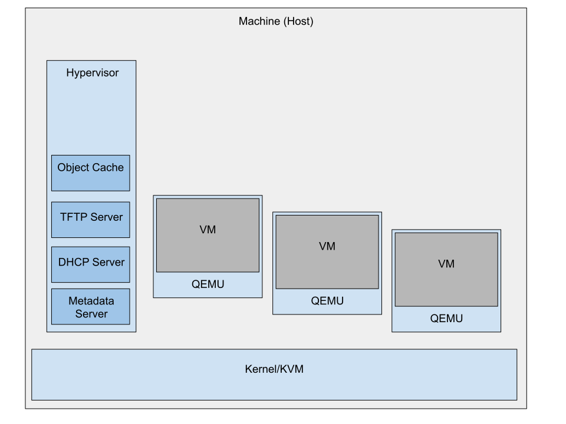
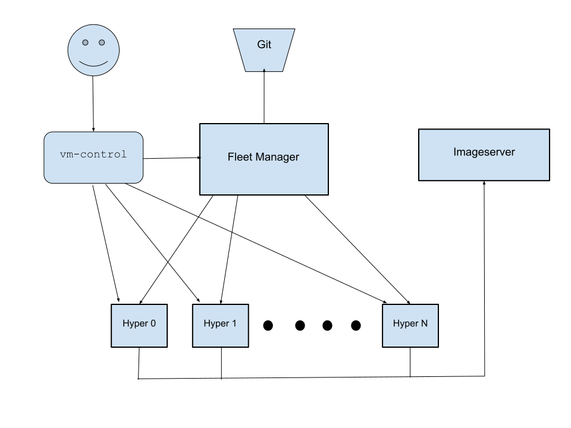

SmallStack: Simple, Scalable VM Management
==========================================
Richard Gooch
-------------

Abstract
========

This paper describes a VM management system for a Private Cloud environment which is simple to configure and deploy, has few dependencies, scales to many thousand physical machines (nodes) with hundreds of VMs per node, is highly reliable and has dynamic IP address allocation. VM create time is as low as one second, which is best in class and approaches container platform performance. This system can integrate closely with the [**Dominator**](https://github.com/Cloud-Foundations/Dominator) ecosystem which provides [manifest driven image generation](https://github.com/Cloud-Foundations/Dominator/blob/master/user-guide/image-manifest.md) with the [Imaginator](https://github.com/Cloud-Foundations/Dominator/blob/master/cmd/imaginator/README.md), high performance image distribution and image-based patching. While you can easily create pets, you also get the tools to farm cattle. By leveraging [Keymaster](https://github.com/Symantec/keymaster), existing organisation/corporate identities may be used for strong authentication (2FA, ephemeral credentials).

Background
==========

Multiple solutions exist for managing Virtual Machines, but each has its own drawbacks:

-   Expensive, no native metadata service, not Open Source (VMware)

-   Complex to configure, deploy, maintain and lack performance and reliability ([OpenStack](https://www.openstack.org/))

-   Limited to small numbers of nodes, no metadata service ([proxmox](https://www.proxmox.com/en/), [Ganeti](http://www.ganeti.org/))

-   Medium complexity, no metadata service, VMs limited to TCP traffic and reliant on SDN/proxies ([virtlet](https://www.mirantis.com/blog/virtlet-vms-containers-opencontrail-network-kubernetes-nfv/))

While much computing workload is migrating to the Public Cloud, there remains a need for on-premise VM capacity. The goal is a cost effective, performant and reliable Private Cloud that lacks the bells and whistles of Public Cloud yet is simple and provides a reliable foundation for baseline computing workload and building add-on services if needed, *without compromising the robustness of the foundational platform*.

The target audience for this system is the medium to large enterprise, yet it is designed to be so easy to configure, deploy and operate that a small enterprise (which often has between zero and one Operations staff) or hobbyist can confidently configure and use it.

Currently out of Scope
----------------------

-   Software Defined Networking (SDN). This is needed in the Public Cloud, as each customer has to be completely isolated and hidden from other customers. In a Private Cloud, this has marginal value and imposes complexity, performance and reliability costs. Depending on your network topology, each VM can route to every other VM (open network) or is blocked (partitioned network)

-   Software Firewalls (aka. Security Groups). Similar to SDN, Software Firewalls provided by the platform (the hypervisors) increase complexity and reduce performance and reliability. Further complexity would be required to correctly attribute the resource costs for software firewalls. The responsibility for network protection is left to the VM users, such as by using iptables

-   Remote storage for VMs (i.e. remote volumes). Again, this would increase the complexity of the platform, reduce reliability and dramatically reduce performance of those VMs. VM users can deploy the remote storage solution that fits their needs. VM users who are satisfied with local storage can enjoy a more robust platform. If there is sufficient demand, support for GlusterFS volumes may be added (management of GlusterFS would remain out-of-scope)

-   Live Migration. This is tricky to get right, and has marginal value. Non-live migration is supported, however

-   Load Balancers. These introduce complexity and may *reduce* reliability, so the platform does not provide these. These should be provided by the user inside their VM(s). A well architected client-server system does not need a Load Balancer, as the client(s) should be smart and automatically fail over to a working server. Simple-minded architectures rely on Load Balancers to implement High Availability, thus the Load Balancer becomes a Single Point Of Failure (SPOF) and has to be provisioned/scaled in order to handle peak demand

-   Machine Learning. Speech recognition. Serverless. This project is not trying to (and cannot) compete with the leading Public Cloud offerings. We love to KISS (Keep It Simple, Stupid)

Finally, while SmallStack includes support for installing physical machines, it is not intended to provide a generic Metal as a Service platform such as [Digital Rebar](https://rebar.digital/). At the physical layer, the focus is on installing and managing the life-cycle of Hypervisors.

Design
======

A core invariant is that *every node (physical machine) and VM (virtual machine) has a unique IP address*. The IP address is the primary key by which machines are identified.

Core Components
---------------

This system has three main components:

-   The Hypervisor

-   The Fleet Manager

-   The vm-control utility (or API)

All components are simple-to-deploy Go binaries, built from Open Source software.

### The Hypervisor

This is an agent that runs on each physical node. It has the following responsibilities and components:

-   Uses QEMU+KVM to run VMs

-   Manages the node capacity (CPU, RAM and local storage)

-   Contains a built-in DHCP server to provide network configuration information to the VMs and for installing other Hypervisors via PXE boot

-   Contains a built-in TFTP server which may be used for [birthing](../MachineBirthing/README.md) physical machines (i.e. other Hypervisors) via PXE boot

-   Contains a metadata server (on the 169.254.169.254 link-local address) which can provide other configuration information and credentials to the VMs. [Appendix 1: Metadata Server](#_m32qdtj523bz) contains more information

-   Object Cache which caches some commonly-used objects in the [**Dominator**](../Dominator/README.md) ecosystem images. This optional cache improves the performance of creating and updating VMs using these images

A diagram is shown below:


Configuration of the Hypervisor is minimal: the directory to store saved state and the location of an optional [imageserver](https://github.com/Cloud-Foundations/Dominator/blob/master/cmd/imageserver/README.md) from where images may be fetched from. Requests to launch VMs are made directly to the Hypervisor by the vm-control utility (or API); The Fleet Manager is not involved in this transaction, although it may (optionally) be used to easily find a Hypervisor with available capacity.

The user requests the creation of a VM of a specified size and if the Hypervisor has sufficient capacity, the VM is created and the user is given the IP address of the new VM in the response, otherwise an error is returned.

The Hypervisor starts the QEMU process, which detaches and runs in the background. The Hypervisor communicates with the QEMU monitor process over a Unix socket. If the Hypervisor process hangs or crashes, there is no effect on the running VMs. It will reconnect to the monitor socket at startup. Thus, the Hypervisor can be upgraded without any impact to running VMs.

The Hypervisor probes the node at startup to determine the total machine capacity. When the Hypervisor is first created, it is initially unable to create VMs because it does not know which IP and MAC addresses are available to allocate to VMs. The Fleet Manager will provide a list (pool) of IP and MAC addresses to the Hypervisor. Once the Hypervisor has this list, it can create VMs until this pool is depleted. The pool is continuously replenished by the Fleet Manager. When a VM is destroyed, the IP and MAC addresses are returned to the pool, and are available for immediate reuse.

### The Fleet Manager

The Fleet Manager performs several functions:

-   Address pool replenishment

-   Poll Hypervisors to find VMs and monitor utilisation metrics

-   Provide a directory service for the vm-control utility or API

-   Manage VM snapshots (backups) of VM volumes

The Fleet Manager reads the configuration of the fleet (typically from a URL pointing to a directory tree in a Git repository). This configuration includes:

-   Physical groupings of machines, such as:

    -   region

    -   building

    -   isle

    -   rack

-   Routing, VLAN and subnet mappings

The topology is discussed in more detail below.

The scope of the Fleet Manager is deliberately limited so that it is reliable and performant, even when managing very large fleets.

#### Address Pool Replenishment

The Fleet Manager has the essential function of monitoring the spare pool of IP and MAC addresses that each Hypervisor has and replenishing those pools when they fall below a threshold. The thresholds at which to replenish or reclaim the Hypervisor address pools are configurable, with the following defaults:

-   Desired number of free addresses: 16

-   Threshold below which the pool is replenished with more addresses (low watermark): 8

-   Threshold above which free addresses are reclaimed (high watermark): 24

Using the fleet topology and this configuration it computes IP and MAC address blocks that may be assigned to different groups of Hypervisors and hands them out in small chunks.

The Fleet Manager is not directly involved in VM creation and thus does not present a single point of failure (SPOF), provided Hypervisors have available IP and MAC addresses in their pools. Since the replenishment threshold is configurable, choosing a large value such as 256 would likely ensure that Hypervisors do not exhaust their pools, even if the Fleet Manager is unavailable indefinitely.

#### Polling Hypervisors

In addition to replenishing the address pools for Hypervisors, the Fleet Manager also receives VM create, change and destroy events from the Hypervisors. It additionally polls the Hypervisors for utilisation metrics. It maintains a global view of all the VMs in the fleet, their placement and their utilisation. This global view information is made available as a dashboard and via a RPC protocol for other tools and systems.

#### Directory Service

The Fleet Manager provides a directory service for the vm-control utility or API, so that the utility knows where to find a Hypervisor with available capacity. This service is a (significant) convenience, but is not essential. If the DNS name or address of a Hypervisor with available capacity is known through some other means, the vm-control utility can be provided that information.

#### Manage VM Snapshots

When a VM is created, an optional automated snapshot (backup) schedule may be specified. The Fleet Manager will instruct Hypervisors to perform snapshots of the local storage volumes for these VMs and will upload the snapshots to a remote object store such as GlusterFS or AWS S3. The data are encrypted by the Hypervisor prior to uploading. The orchestration of snapshotting is centrally managed so that global rate limits and load management may be enforced.

#### High Availability

As discussed above, the Fleet Manager is not essential to either the health of VMs nor for management of VMs, but it is very convenient for the latter. A highly available service using round-robin DNS may be implemented by running multiple Fleet Manager instances, with only one configured to manage the Hypervisors (updating address pools and subnets) and the rest only providing directory services. For each Fleet Manager instance, the IP address is stored in a DNS A record for the Fleet Manager FQDN (i.e. fleet-manager.company.com). Clients such as the vm-control utility or a web browser will automatically connect to a working instance. No load balancer is required, instead the tool/web browser will time out a connection attempt to an unresponsive Fleet Manager instance and try another instance listed in the DNS record.

A diagram is shown below:


### The vm-control utility/API

The [vm-control](https://github.com/Cloud-Foundations/Dominator/blob/master/cmd/vm-control/README.md) utility orchestrates the creation, starting, stopping and destruction of VMs. It typically consults the Fleet Manager to obtain the global view of Hypervisors, their physical location (i.e. failure zones), available capacity and the placement of VMs. This global view is used to find the required Hypervisor. If the address of the Hypervisor is provided, then the Fleet Manager is not consulted. Typical VM creation options that are supported are:

-   Create VM of specified size anywhere

-   Create one VM per rack or isle

-   Create VM in the same Hypervisor as a specified VM

-   Create VM in the same rack as a specified VM

-   Create VM in a different rack/isle as a specified VM

-   Create VM using the same configuration (size, image) as a specified VM

-   Create a VM from a snapshot of another VM

-   Migrate a VM to another Hypervisor

Since all the intelligence of VM orchestration is the responsibility of the vm-control utility, more advanced features such as VM migration and rolling migrations can be added without risking the health of the fleet; neither the Hypervisor or the Fleet Manager require new code or extra complexity. They only perform some basic services and implement simple primitives. Different users can experiment with new orchestration features, independently, *without compromising the reliability or integrity of the platform*. Integration with other systems (such as updating a Machine DataBase or DNS records) can be added by the user, with the potential for different systems to be integrated by different users.

Other VM management operations include:

-   Create an unscheduled snapshot of a VM

-   Replace the root image (volume) of a VM

-   Patch the root image (volume) of a VM

-   Restore the root image (volume) of a VM with the previous volume

-   Stop a VM, preserving the volume(s) on the Hypervisor

-   Stop a VM, snapshot the volume(s) and delete from the Hypervisor

-   Destroy a VM

-   Destroy a VM and all its snapshots

-   Delete snapshot(s) for a VM

-   Start a VM (from local preserved volume or specified snapshot)

-   Connect to a serial port on a VM (remote serial console)

Finally, some low level Hypervisor management operations are supported, which allow for bringing Hypervisors to a useful state even with no Fleet Manager configured:

-   Add an IP and MAC address to the address pool

-   Add a subnet

Please see the [online documentation](https://github.com/Cloud-Foundations/Dominator/blob/master/cmd/vm-control/README.md) for usage information.

Fleet Topology
--------------

As noted above, the placement and grouping of Hypervisors and subnets must be defined and provided to the Fleet Manager. While some grouping types (such as region, isle and rack) may be nearly universal and applicable, other grouping types (building, cabinet, chassis) may be superfluous and cumbersome if there is a requirement to define them. Hypervisors may be grouped at different levels in the topology than subnets in different environments. Further, it is difficult to anticipate other possible grouping types.

Rather than pre-defining (hopefully) all potential grouping types or re-writing the topology schema code for each new use-case, the topology is expressed as a file-system hierarchy (a directory tree) which is recursively processed by the Fleet Manager. This approach allows for arbitrary grouping types. Each grouping type is a (sub)directory tree and is called a *location*, which is a generic grouping concept. A location may refer to the entire world, or a specific region, or a specific rack in a specific region, and so on. Subnet definitions may be placed in any location (directory) in the topology. Subnets defined high in the topology cover large parts of the topology (e.g. an entire region or isle) , whereas subnets placed near the bottom of the topology tree cover only small groups (e.g. a single rack or even a single Hypervisor). It is valid to define a high-level (broad) subnet (i.e. for a “management” VLAN) while also defining low-level (narrow) subnets (i.e. for a “production” VLAN) in the same topology.

### Example Topology

An example topology with two large regions (NYC and SJC) and one smaller region (SYD) is available at [https://github.com/Cloud-Foundations/Dominator/tree/master/cmd/fleet-manager/example-topology](https://github.com/Cloud-Foundations/Dominator/tree/master/cmd/fleet-manager/example-topology). Each region has 3 VLANs:

-   Production: for products serving customers

-   Infrastructure: for internal infrastructure services

-   Egress: for VMs which have Internet egress access via a NAT gateway

VM Migration
------------

As mentioned in the non-goals section earlier, live VM migration is not supported. However, migration with restart is supported. The vm-control utility will instruct the *target* Hypervisor to fetch the local storage of the VM from the *source* Hypervisor. This does not interfere with the running VM. Once fetched, the vm-control utility will instruct the *source* Hypervisor to stop the VM, and will then instruct the *target* Hypervisor to fetch any changes (diffs) since the first fetch. This second fetch should be quite fast, since only changes are fetched. Direct Hypervisor to Hypervisor transfer ensures the best performance. The VM is then started on the *target* Hypervisor and destroyed on the *source* Hypervisor. In most cases, the downtime for the VM is approximately the reboot time for the VM, even though the apparent *migration time* may be significantly longer if a significant amount of data need to be moved.

A more disruptive migration or fleet rebuild may be performed by stopping and snapshotting groups of VMs and later starting VMs (restoring from snapshot) after the rebuild operation has completed.

By default, VM migration is only possible between Hypervisors on the same subnet, so that the IP address can be preserved. The user can choose to migrate with IP address reassignment. If the vm-control utility is integrated with a DNS update system, a change of IP address may be safe for the service that the VM is running.

Boot Images
-----------

The first-class images supported are the [**Dominator**](../Dominator/README.md) ecosystem images. These images are preferred because the [**Dominator**](../Dominator/README.md) ecosystem provides services for easy, reproducible builds, fast distribution of image content and artefact generation for other platforms such as AWS, yielding a true Hybrid Cloud experience for users (developers). They also provide the fastest VM boot experience, typically 5 seconds from the VM create request to when your bootloader is running. These images are Linux only. By encouraging the use of [images built from manifests](https://github.com/Cloud-Foundations/Dominator/blob/master/user-guide/image-manifest.md), it becomes trivially easy to replace or clone VMs across failure domains, whether a different rack, isle, building or geographic region. Furthermore, it is also a simple step to enable the [**Dominator**](../Dominator/README.md) for safe and reliable upgrades, patch management and self-healing.

If you have non-Linux images or do not want to use images from the [**Dominator**](../Dominator/README.md) ecosystem, there are two other supported options for specifying boot image content:

-   A local RAW image (a boot disc image). The vm-control utility will stream the image data to the Hypervisor. For good performance, this should be done close to the Hypervisor (another VM on the same Hypervisor is best)

-   A HTTP/HTTPS URL pointing to a RAW image. In effect, you are providing your own image server. Again, for good performance, the image server should have a fast network connection to the Hypervisor.

With these two options, you can quickly set up the whole system and use familiar tools, keeping the barrier to entry low. You can upgrade to using [**Dominator**](../Dominator/README.md) images at any time.

### cloud-init

The [cloud-init](https://cloud-init.io/) package allows VMs in a Cloud Platform to automatically configure themselves, using data provided by the Cloud Platform (through a metadata service or a virtual configuration drive). With some simple modifications, [cloud-init](https://cloud-init.io/) can support the SmallStack metadata service, allowing VMs to self-configure in the same way.

Upgrading VMs
-------------

Modern DevOps Best Practices for updating services and infrastructure urge the use of immutable infrastructure and strongly discourage logging into machines to perform updates. Rather than update running systems, the philosophy is to deploy new systems (with the latest software), verify and test the new systems and (gradually) replace the old systems with the new ones (such as by redirecting requests/workload from old to new systems). While SmallStack fully supports (and encourages) this model, it is recognised that this model may be more challenging to adopt, particularly in on-premise environments, for various reasons:

-   Systems may have a large amount of data which are costly or time-consuming to move

-   The IP addresses of systems may be configured into other dependent systems (i.e. network devices such as routers, firewalls and load balancers)

SmallStack provides easy to use, leading-edge options for updating systems that retain many of the benefits of the immutable infrastructure model (reproducible deployments, consistency across systems, no partial updates) without the above challenges. There are 3 update modes available:

-   **Live patching** VMs with the [**Dominator**](../Dominator/README.md). This requires the [subd](https://github.com/Cloud-Foundations/Dominator/blob/master/cmd/subd/README.md) agent to run in the VMs. It is the fastest way to update VMs with the least service disruption (updating services are stopped for under a second while critical changes are made). This is limited to Linux VMs as the [subd](https://github.com/Cloud-Foundations/Dominator/blob/master/cmd/subd/README.md) agent has not been ported to other operating systems

-   **Zombie patching** of VMs by using the same image-based patching used by the [**Dominator**](../Dominator/README.md) for the root volume. The VM must be stopped, then the Hypervisor will perform the update on the root volume, after which the VM may be started again. As with live patching, configuration changes and data are not modified. This approach is more disruptive than live patching as the VM needs to be shutdown, upgraded and then started, but does not require running an agent in the VMs. This is limited to VMs which use the Linux ext4fs for the root volume

-   **Carrousel (rebirth)** of VMs by *replacing* the root volume with a new boot image. A fresh root volume is created from an image source and the root volume for the VM is replaced (while the VM is stopped). The old root volume is preserved in case a rollback (restore) is required. Secondary volumes which typically contain large data stores are unaffected. This approach is the most disruptive as any configuration changes made on the previous root volume will be lost. The image replacement method has the advantage of working for all guest OS types and does not require running an instance of [subd](https://github.com/Cloud-Foundations/Dominator/blob/master/cmd/subd/README.md) in the VM or require a specific file-system format for the root volume. To help mitigate the loss of configuration changes, configuration data may be stored in the user data for the VM, which are available from the metadata service. User data are persistent for the lifetime of the VM and are independent of the root volume.

Upgrading Hypervisors
---------------------

The principal challenge in maintaining a Private Cloud lies with managing the system software life-cycle of the infrastructure, particularly the Hypervisors. There is a need for safe and rapid patching capability (for security, bugs or features). Hypervisors cannot be redeployed, as they contain precious data and workloads (VMs) that are costly to move. Since SmallStack evolved out of the [**Dominator**](../Dominator/README.md) ecosystem, image-based live-patching of Hypervisors is not just supported but is the recommended method for life-cycle maintenance. The [hyper-control](https://github.com/Cloud-Foundations/Dominator/blob/master/cmd/hyper-control/README.md) utility allows rolling out a [**Dominator**](../Dominator/README.md) ecosystem image to a fleet of Hypervisor in minutes. This rollout uses an [arithmetic progression](https://en.wikipedia.org/wiki/Arithmetic_progression) in a sequence of steps:

-   First one Hypervisor is upgraded and a health check performed (concurrency=1)

-   If healthy, two Hypervisors are upgraded (concurrency=2)

-   For every step that completes (Hypervisors upgraded and health checks pass), the concurrency level is incremented by one before starting the next step

-   If a health check fails, the rolling upgrade is halted

The rollout starts slowly, and gains speed as more Hypervisors are successfully upgraded. The number of rollout steps is approximately sqrt(N\*2) where N is the number of Hypervisors. Here are some example rollout times:

-   100 Hypervisors, no reboot needed (15 second upgrade+test): 3m32s

-   100 Hypervisors, fast reboot (1 minute upgrade+test): 14m9s

-   100 Hypervisors, slow reboot (5 minute upgrade+test): 1h11m

-   10000 Hypervisors, no reboot needed (15 second upgrade+test): 35m21s

-   10000 Hypervisors, fast reboot (1 minute upgrade+test): 2h21m

-   10000 Hypervisors, slow reboot (5 minute upgrade+test): 11h47m

The reboots are required if the kernel on the Hypervisor needs to be upgraded. Since this is less common than upgrading other system software, most fleet upgrades run at the higher speed.

Since the rollout is fully automated, the burden is low. Security patches can be applied promptly, safely and with confidence.

Security Model
--------------

All RPC methods require client-side X509 certificates and are secured with SSL/TLS1.2 or higher. This is the same mechanism used in the rest of the [**Dominator**](../Dominator/README.md) ecosystem. The ephemeral certificates that [Keymaster](https://github.com/Symantec/keymaster) generates may be used directly to identify users and their group memberships which are used to determine whether to grant or deny access to create and manipulate VMs. Access to VMs and subnets is granted based on the identity of the user and their group memberships (i.e. LDAP groups). This simple yet flexible approach leverages existing roles/groupings in an organisation, avoiding the need to maintain a mapping between one authentication and authorisation system and another one.

Stated simply: SmallStack uses existing Corporate/Organisational identities/credentials.

Credential Management (Coming soon)
-----------------------------------

As stated above, SmallStack integrates with a simple, yet very secure system to authenticate users when accessing resources (VMs). In many environments, credentials are required not only for *users* but also *services* (aka automation users). A service requires long-lived credentials in order to continue to function. Unfortunately, these long lived credentials are often poorly managed and are frequently stored in convenient but insecure locations (documents, source code repositories, web servers, S3 buckets, etc.). These unsecured credentials are routinely leaked, leading to system and data compromise.

SmallStack leverages the cababilities of [Keymaster](https://github.com/Symantec/keymaster) to generate short-term credentials for automation users (please see the section “Automation user support” in the [Keymaster](https://github.com/Symantec/keymaster) design document for details). A user may create a VM and request to assign a *role* to the VM. The role is simply an automation user. The vm-control tool will request a long-term credential for the specified automation user. If granted, this credential is passed to the Hypervisor. The Hypervisor will periodically use this credential to request a short-term credential for the automation user. This credential is provided to the VM via the metadata service. Service code running on the VM thus has access to updated credentials which can be used to authenticate the service to other services. The burden of credential management is removed from users and their deployment tools; instead the SmallStack platform manages their credentials securely and conveniently. This is similar to the assignment of roles to instances (VMs) in AWS.

### Associating AWS Roles

With the above capability to assign an internal ([Keymaster](https://github.com/Symantec/keymaster)) role to a VM, this can be further extended by using the [CloudGate](https://github.com/Symantec/Cloud-Gate) Federated Broker. The internal role is mapped to an AWS role. The Hypervisor can use the ephemeral [Keymaster](https://github.com/Symantec/keymaster) credentials to request AWS API STS access tokens from [CloudGate](https://github.com/Symantec/Cloud-Gate). These STS tokens are provided to the VM via the metadata service, at the same URL as the AWS metadata service. Code running on SmallStack VMs can thus make AWS API calls just as may be done on an AWS instances without any modification of the code required. This allows infrastructure running on-premise in a Private Cloud to integrate more seamlessly with Public Cloud infrastructure. The vm-control tool will request an AWS role to associate with the VM, and the SmallStack Platform will transparently provide and manage the credentials.

Siloed Networks
---------------

In some environments, networks may be siloed from each other for security or compliance reasons. This design allows for central visibility and resource management even in the presence of separated (firewalled) networks, provided that networks do not have overlapping IP addresses. If the Fleet Manager can connect to all the Hypervisors, then the single view of all resources can be preserved. This avoids duplication of resources. Since it is only the vm-control utility which can create or mutate VMs, a user can create or mutate VMs provided their connection to the relevant Hypervisor is not blocked by firewalls.

It is recommended that Hypervisors in siloed networks can be reached from a common Fleet Manager and that these Hypervisors can connect to a common [imageserver](https://github.com/Cloud-Foundations/Dominator/blob/master/cmd/imageserver/README.md) from the [**Dominator**](../Dominator/README.md) ecosystem. This avoids any duplication of resources yet supports the strong network isolation that some may desire. If snapshots are required, the Hypervisors must be able to connect to the remote storage system(s).

Containers
----------

These are all the rage now. A container cluster can be deployed onto the VMs. A more exciting possibility is integrating a container orchestrator such as Kubernetes with this system. The capacity could be dynamically shared between VMs and container pods, with the containers running directly on the nodes.

A more advanced integration would be to implement “Container VMs”. In this system, the container orchestrator would use the Hypervisor to launch a VM with a stripped down hosting kernel and container/pod manager. The platform would provide the kernel, thus hiding the details from the user. These containers would enjoy stronger isolation and security properties than normal containers. A container with root access would be safe to run, being isolated in its dedicated VM. Prior work on [Clear Containers](https://lwn.net/Articles/644675/) suggests subsecond container (stripped down VM) start times are feasible.

Appendix 1: Metadata Server
===========================

The metadata server provides a simple information/introspection service to all VMs. It is available on port 80 of the link-local address 169.254.169.254. This may be used by cloud-init to introspect and configure the VM. The following paths are available:

| Path                                       | Contents                            |
|--------------------------------------------|-------------------------------------|
| /datasource/SmallStack                     | true                                |
| /latest/dynamic/epoch-time                 | Seconds.nanoseconds since the Epoch |
| /latest/dynamic/instance-identity/document | VM information                      |
| /latest/user-data                          | Raw blob of user data               |

The Hypervisor control port (typically 6976) is also available at the link-local address 169.254.169.254. This allows VMs (with valid identity certificates) to create sibling VMs without needing to know their location in the network topology. An example application of this feature is a builder service orchestrator which creates a sibling VM to build an image with potentially untrusted code.

Networking Implementation
-------------------------

The metadata server is part of the Hypervisor process on the host machine, which poses some technical challenges:

-   The host may not be on the same subnet/VLAN as the VMs

-   The host may have an existing service on port 80

To solve this the Hypervisor, for each bridge device:

-   Creates a new Linux Network Namespace (Linux Namespaces are the foundational technology for Containers). This is the metadata server namespace

-   Creates a veth (virtual EtherNet) device pair

    -   Moves one side into the metadata namespace and configures it with the link-local address (169.254.169.254)

    -   Attaches the remaining side to the bridge device (in the primary namespace)

-   Adds routing table entries for all the subnets in the metadata namespace. This allows packets from the metadata server to reach the VMs

-   Creates a listening socket on port 80 in the metadata namespace

-   Creates an ebtables PREROUTING chain on the nat table for the bridge device to direct packets for the link-local address to the MAC address of the veth device in the metadata namespace.This allows packets from the VMs (addressed to the metadata service) to reach the metadata server

Appendix 2: Performance
=======================

Baseline VM
-----------

A typical Debian v9 (Stretch) VM with a 1 GiB root volume takes approximately 10 seconds to create, boot up and be ready to accept SSH connections. The Hypervisor CPU is an Intel Xeon E5-2650 v2 @ 2.60GHz with spinning HDD storage. The time is spent in these main activities:

-   5 seconds fetching the image from the [imageserver](https://github.com/Cloud-Foundations/Dominator/blob/master/cmd/imageserver/README.md) and unpacking into the root volume. The larger the image, the more time will be taken. A future version of the Hypervisor will employ a local object cache to improve this by at least a factor of 2

-   1 second installing the bootloader (GRUB). A future version of the Hypervisor will support direct booting for Linux kernels

-   3 seconds between the start of the VM and when the OS requests an IP address via DHCP

-   1 second for cloud-init and other boot code in the VM to complete and SSH to be ready

Below is an example log from vm-control creating such a VM with total time taken shown after:

```
2018/12/15 10:02:07 creating VM on hyper-567.sjc.prod.company.com:6976
2018/12/15 10:02:07 getting image
2018/12/15 10:02:08 unpacking image
2018/12/15 10:02:13 starting VM
10.2.3.4
2018/12/15 10:02:16 Received DHCP ACK
2018/12/15 10:02:17 /datasource/SmallStack
2018/12/15 10:02:17 /latest/user-data
2018/12/15 10:02:17 /latest/dynamic/instance-identity/document
2018/12/15 10:02:17 /latest/dynamic/instance-identity/document
2018/12/15 10:02:17 /latest/dynamic/instance-identity/document
2018/12/15 10:02:18 Port 22 is open

real 0m10.254s
user 0m0.016s
sys 0m0.004s
```

Optimised VM boot
-----------------

The above Debian v9 (Stretch) VM configuration takes approximately 7-8 seconds to create, boot up and be ready for SSH connections when using the following optimisations:

-   Local object cache

-   Direct kernel booting (skipping bootloader)

The boot time breakdown is:

-   2.5 seconds fetching the image from the [imageserver](https://github.com/Cloud-Foundations/Dominator/blob/master/cmd/imageserver/README.md) and unpacking into the root volume

-   3 seconds between the start of the VM and when the OS requests an IP address via DHCP

-   1 second for cloud-init and other boot code in the VM to complete and SSH to be ready

Below is an example log from vm-control creating such a VM with total time taken shown after:

```
2019/01/11 08:06:31 creating VM on hyper-567.sjc.prod.company.com:6976
2019/01/11 08:06:31 getting image
2019/01/11 08:06:31 unpacking image: minimal/Debian-9/2019-01-11:07:16:45
2019/01/11 08:06:35 starting VM
10.2.3.4
2019/01/11 08:06:38 Received DHCP ACK
2019/01/11 08:06:38 /datasource/SmallStack
2019/01/11 08:06:38 /latest/user-data
2019/01/11 08:06:39 Port 22 is open
real 0m7.447s
user 0m0.020s
sys 0m0.000s
```

Appliance (container) VM
------------------------

A simple image with a stripped-down kernel (all drivers built into the kernel, virtio driver), no bootloader, no initrd and an init script which only runs the udhcpc DHCP client takes 1.2 seconds to boot. A future version of the Hypervisor may support [Firecracker](https://github.com/firecracker-microvm/firecracker) ([announced](https://aws.amazon.com/blogs/aws/firecracker-lightweight-virtualization-for-serverless-computing/) by AWS) to further reduce this time.

Below is an example log from vm-control creating such a VM with total time taken shown after:

```
2019/01/12 00:24:43 creating VM on localhost:6976
2019/01/12 00:24:43 getting image
2019/01/12 00:24:43 unpacking image: test/2019-01-12:00:13:20
2019/01/12 00:24:43 starting VM
10.2.3.4
2019/01/12 00:24:44 Received DHCP ACK
real 0m1.216s
user 0m0.019s
sys 0m0.011s
```
